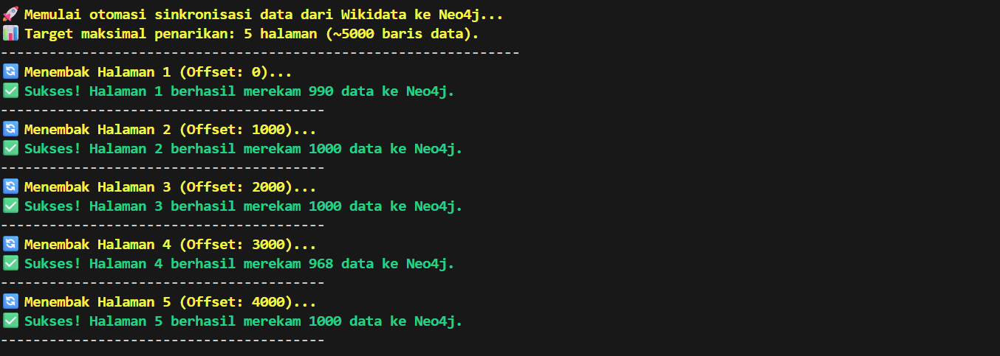
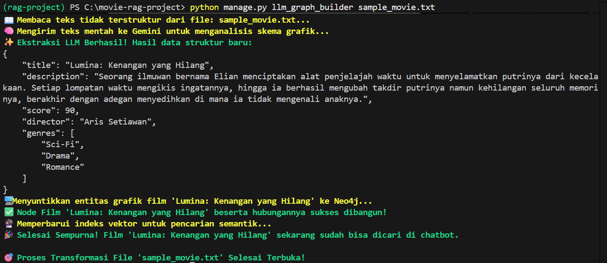
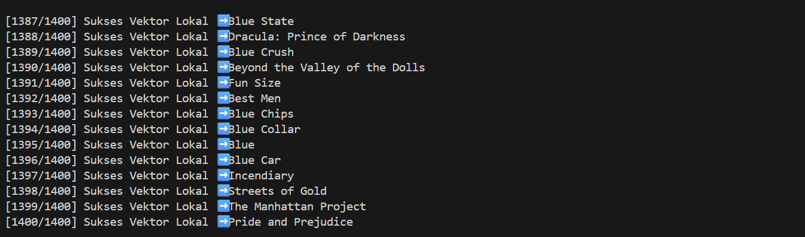
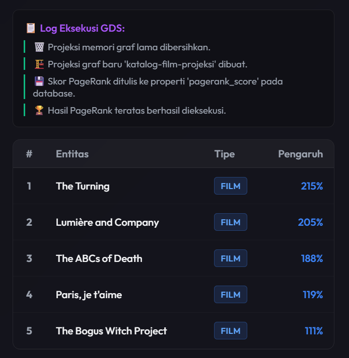
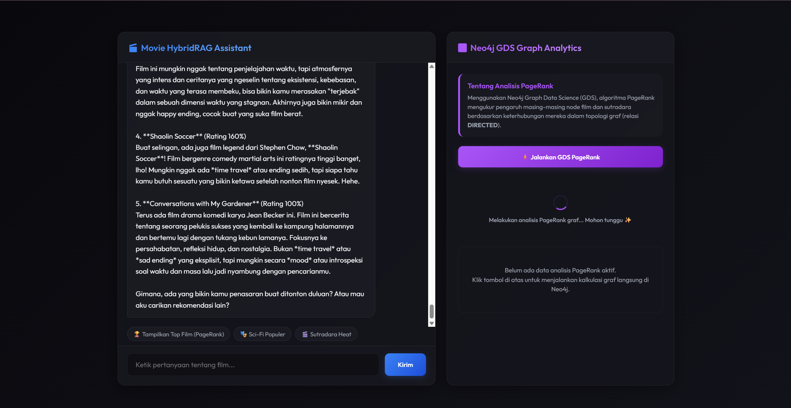

# Movie HybridRAG & Graph Analytics Assistant

Aplikasi ini adalah asisten pencarian katalog film pintar yang menggunakan teknologi **Knowledge Graph RAG (GraphRAG)** dan **Graph Analytics**. Sistem ini menggabungkan basis data grafik (Neo4j), algoritma kecerdasan grafik (Graph Data Science PageRank), pencarian makna teks lokal (Hugging Face Local Embeddings), serta kecerdasan buatan Gemini 2.5 Flash.

Aplikasi ini dapat membantu pengguna menemukan rekomendasi film berdasarkan hubungan data (seperti genre dan sutradara) maupun makna cerita (sinopsis), sekaligus mengukur tingkat pengaruh atau kepopuleran film berdasarkan jaringan sutradara secara real-time.

---

## Daftar Isi
1. [Konsep Dasar (Untuk Pengguna Umum)](#1-konsep-dasar-untuk-pengguna-umum)
2. [Arsitektur & Alur Kerja Sistem](#2-arsitektur--alur-kerja-sistem)
3. [Persyaratan Perangkat Keras & Lunak](#3-persyaratan-perangkat-keras--lunak)
4. [Langkah Instalasi & Konfigurasi](#4-langkah-instalasi--konfigurasi)
5. [Langkah Menjalankan Aplikasi](#5-langkah-menjalankan-aplikasi)
6. [Django Management Commands (Pengolahan & Analisis Data)](#6-django-management-commands-pengolahan--analisis-data)
7. [Spesifikasi Tata Letak Antarmuka (UI/UX)](#7-spesifikasi-tata-letak-antarmuka-uiux)
8. [Panduan Penggunaan Fitur Browser](#8-panduan-penggunaan-fitur-browser)

---

## 1. Konsep Dasar (Untuk Pengguna Umum)

*   **Knowledge Graph (Graf Pengetahuan)**: Berbeda dengan basis data biasa yang berbentuk tabel, basis data grafik menyimpan informasi sebagai objek (seperti *Film*, *Sutradara*, *Genre*) dan menghubungkannya dengan garis relasi (seperti *DIRECTED* atau *HAS_GENRE*). Hal ini membuat pencarian hubungan antardata menjadi sangat cepat dan akurat.
*   **GraphRAG (Retrieval-Augmented Generation berbasis Graf)**: Metode pencarian informasi yang mencocokkan pertanyaan Anda dengan data grafik, lalu mengirimkan data tersebut ke AI untuk disusun menjadi jawaban bahasa manusia yang alami.
*   **Graph Analytics (PageRank)**: Algoritma yang digunakan oleh mesin pencari (seperti Google) untuk mengukur tingkat kepopuleran suatu halaman. Di aplikasi ini, PageRank mengukur film mana yang paling berpengaruh di dalam database berdasarkan keterhubungannya dengan sutradara-sutradara ternama.

---

## 2. Arsitektur & Alur Kerja Sistem

Sistem ini menggunakan metode pencarian dua jalur (**Hybrid RAG**) untuk meminimalkan kegagalan pencarian:

```
                      +------------------+
                      | Pertanyaan User  |
                      +--------+---------+
                               |
                               v
                  +------------+------------+
                  |  Pembersihan Masukan    | (Memperbaiki typo & menyelaraskan genre)
                  +------------+------------+
                               |
                               v
                  +------------+------------+
                  | Pembuatan Kueri Cypher  | (AI merancang bahasa kueri Neo4j)
                  +------------+------------+
                               |
             +-----------------+-----------------+
             | (Pembuatan Kueri Berhasil)        | (Kueri Gagal / Hasil Kosong)
             v                                   v
+------------+------------+         +------------+------------+
| Eksekusi Basis Data Graf|         | Pencarian Makna (Vektor)| (Mencari kemiripan sinopsis)
+------------+------------+         +------------+------------+
             |                                   |
             +-----------------+-----------------+
                               |
                               v
                  +------------+------------+
                  | Penyelarasan Informasi  | (Mengumpulkan & merapikan data)
                  +------------+------------+
                               |
                               v
                  +------------+------------+
                  |  Penyusunan Jawaban AI  | (Menyusun kalimat ramah & informatif)
                  +------------+------------+
                               |
                               v
                      +--------+---------+
                      |   Jawaban Final  |
                      +------------------+
```

### Penjelasan Tahapan Kerja:
*   **Pembersihan Masukan (Input Preprocessing)**: Sistem secara otomatis mendeteksi salah ketik (typo) pada nama sutradara atau judul film, serta menerjemahkan genre bahasa Indonesia (misal: "fiksi ilmiah" menjadi "Sci-Fi") agar sesuai dengan istilah di basis data.
*   **Pembuatan Kueri Cypher**: AI (Gemini 2.5 Flash) menerjemahkan pertanyaan pengguna menjadi bahasa kueri grafik (Cypher). Dilengkapi dengan sistem pengaman bawaan (*Guardrail*) agar nama indeks pencarian tidak salah terbaca.
*   **Pencarian Makna (Vector Semantic Fallback)**: Jika pencarian hubungan grafik tidak membuahkan hasil (misal pengguna mencari tema cerita abstrak seperti "film tentang kesedihan mendalam"), sistem akan beralih mencari kemiripan sinopsis menggunakan pencarian vektor lokal Hugging Face.
*   **Kalkulasi PageRank**: Algoritma menghitung skor pengaruh film berdasarkan pola hubungan sutradara dan film. Skor desimal yang dihasilkan kemudian diubah ke dalam bentuk persentase bobot pengaruh agar mudah dipahami pengguna (contoh: nilai PageRank 2.15 ditampilkan sebagai pengaruh sebesar 215%).

---

## 3. Persyaratan Perangkat Keras & Lunak

Sebelum menjalankan aplikasi, pastikan komputer Anda sudah terpasang:
*   **Python versi 3.12** atau yang lebih baru.
*   **Docker & Docker Compose** (digunakan untuk menjalankan database Neo4j dengan mudah dan terisolasi).

---

## 4. Langkah Instalasi & Konfigurasi

### Langkah 1: Persiapan Folder & Lingkungan Virtual
Unduh proyek ini, buka terminal/command prompt pada folder proyek tersebut, lalu ketik perintah berikut:
```bash
# Membuat lingkungan virtual Python agar library tidak bentrok
python -m venv rag-project

# Mengaktifkan lingkungan virtual (Windows PowerShell)
.\rag-project\Scripts\Activate.ps1

# Mengaktifkan lingkungan virtual (Command Prompt Biasa)
.\rag-project\Scripts\activate.bat

# Mengunduh seluruh pustaka (library) pendukung yang dibutuhkan
pip install -r requirements.txt
```

### Langkah 2: Pengaturan Berkas Konfigurasi (`.env`)
Buat berkas baru bernama `.env` di dalam folder utama proyek (sejajar dengan berkas `manage.py`), kemudian isi dengan kode berikut:
```env
GEMINI_API_KEY=masukkan_api_key_gemini_anda_di_sini
NEO4J_URI=bolt://localhost:7687
NEO4J_USER=neo4j
NEO4J_PASSWORD=password123
```
> [!NOTE]
> API Key Gemini dapat diperoleh secara gratis melalui Google AI Studio.

### Langkah 3: Menjalankan Database Grafik Neo4j
Jalankan database Neo4j di dalam kontainer Docker dengan perintah:
```bash
docker-compose up -d
```
> [!IMPORTANT]
> Perintah ini otomatis mengaktifkan database Neo4j pada port default, lengkap dengan plugin penting seperti Graph Data Science (GDS) dan APOC yang dibutuhkan untuk perhitungan statistik grafik.

---

## 5. Langkah Menjalankan Aplikasi

Aplikasi dapat dijalankan melalui dua metode: **Metode A (Menjalankan secara Lokal)** menggunakan lingkungan virtual Python, atau **Metode B (Menjalankan via Docker Compose)** untuk kontainerisasi penuh.

### Metode A: Menjalankan secara Lokal (Standard)

#### Langkah 1: Sinkronisasi Database Web (Migrasi Django)
Jalankan perintah berikut untuk mempersiapkan database internal aplikasi web:
```bash
python manage.py migrate
```

#### Langkah 2: Menjalankan Server Web Django
Nyalakan server aplikasi web dengan perintah:
```bash
python manage.py runserver
```
Setelah server menyala, buka peramban Anda lalu kunjungi alamat: `http://127.0.0.1:8000/` untuk masuk ke halaman chat.

---

### Metode B: Menjalankan secara Penuh via Docker Compose (Kontainerisasi)

Proyek ini sudah dilengkapi dengan `dockerfile` untuk membungkus kode Django, serta konfigurasi layanan `web` di dalam `docker-compose.yml`. Secara standar, layanan `web` ini sengaja dinonaktifkan (diberi tanda komentar `#`) agar Anda tetap dapat melakukan pengembangan lokal dengan nyaman.

Jika Anda ingin menjalankan seluruh ekosistem aplikasi (Django + Neo4j) di dalam Docker secara otomatis:
1. Buka berkas `docker-compose.yml`.
2. Hapus tanda pagar komentar (`#`) pada seluruh baris layanan `web` di bagian bawah berkas.
3. Jalankan perintah berikut untuk membangun *image* Django dan menghidupkan seluruh kontainer:
   ```bash
   docker-compose up -d --build
   ```
4. Sistem akan otomatis menyalakan Neo4j terlebih dahulu, mengunduh serta memasang plugin statistik grafik GDS dan APOC. Setelah Neo4j sehat (`service_healthy`), kontainer Django (`django-chatbot-app`) akan otomatis diaktifkan dan dapat diakses langsung pada port `8000` (`http://localhost:8000`).

---

## 6. Django Management Commands (Pengolahan & Analisis Data)

Aplikasi ini menyediakan tiga perintah Django (*Management Commands*) di dalam folder `chatbot/management/commands` untuk proses administrasi data, ekstraksi berbasis AI, dan kalkulasi analisis grafik.

### A. Perintah Pengambilan Data (`fetch_wikidata`)
*   **Kegunaan**: Mengambil data film asli (judul, nama sutradara, deskripsi, dan genre) dari basis pengetahuan Wikidata secara *live* menggunakan kueri SPARQL secara bertahap (per halaman). Perintah ini dilengkapi dengan otomasi pembersihan data (menyingkirkan ID kode Q-ID) dan normalisasi skor (`normalize_to_100`) untuk mengonversi format nilai beragam (persentase, skala 10, dll) menjadi skala seragam 0-100. Data hasil transformasi disuntikkan secara massal (*batch ingestion*) ke Neo4j menggunakan Cypher `UNWIND`.
*   **Cara Penggunaan**:
    ```bash
    # Mode Standar: Menarik data baru tanpa menyentuh data lama
    python manage.py fetch_wikidata --max-pages 5

    # Mode Clean Sync: Menghapus semua isi grafik Neo4j sebelum sinkronisasi dimulai
    python manage.py fetch_wikidata --max-pages 10 --truncate
    ```
*   **Parameter:**
    | Parameter | Kegunaan | Standar |
    | :--- | :--- | :--- |
    | `--max-pages` | Batas maksimal halaman data yang ditarik dari Wikidata (1 halaman = 1000 data) | `125` |
    | `--truncate` | Flag opsional untuk menghapus seluruh node dan relasi di Neo4j sebelum proses impor | `False` (Tidak aktif) |

*   **Petunjuk Eksekusi**:
    

### B. Perintah Ekstraktor Sinopsis (`llm_graph_builder`)
*   **Kegunaan**: Mentransformasikan dokumen teks bebas atau sinopsis film tidak terstruktur (seperti berkas `.txt`) menjadi struktur grafik Neo4j secara otomatis. Perintah ini membaca teks, mengekstrak entitas (*Film*, *Director*, *Genre*) serta hubungannya menggunakan kecerdasan Gemini API, memasukkannya ke database, dan menghasilkan koordinat makna teks (*embedding vector*) menggunakan Hugging Face lokal agar film dapat langsung dicari melalui obrolan RAG.
*   **Cara Penggunaan**:
    ```bash
    python manage.py llm_graph_builder sample_movie.txt
    ```
*   **Parameter:**
    | Parameter | Status | Kegunaan |
    | :--- | :--- | :--- |
    | `file_path` (Argumen 1) | Wajib | Jalur lengkap atau nama berkas `.txt` yang ingin dibaca dan diolah |

*   **Petunjuk Eksekusi**:
    

### C. Perintah Pembuat Vektor Semantik Lokal (`ingest_local_embedding`)
*   **Kegunaan**: Mengambil data seluruh film dari Neo4j yang belum memiliki koordinat vektor (`embedding_vector`), menghitung nilai embeddings menggunakan model Hugging Face secara lokal/offline (bebas kuota API & internet), lalu menyimpannya kembali ke node film terkait di database grafik.
*   **Cara Penggunaan**:
    ```bash
    python manage.py ingest_local_embedding
    ```
*   **Petunjuk Eksekusi**:
    

### D. Perintah Analisis Grafik (`run_graph_analytics`)
*   **Kegunaan**: Menjalankan analisis statistik ketokohan dan kepopuleran film (PageRank) secara manual melalui terminal menggunakan plugin Neo4j Graph Data Science (GDS). Perintah ini akan menghapus proyeksi memori graf yang lama, membuat proyeksi hubungan baru, menjalankan kalkulasi PageRank, dan menampilkan 5 besar film paling berpengaruh di terminal.
*   **Cara Penggunaan**:
    ```bash
    python manage.py run_graph_analytics
    ```
*   **Petunjuk Eksekusi**:
    

---

## 7. Spesifikasi Tata Letak Antarmuka (UI/UX)

Antarmuka aplikasi dirancang menggunakan prinsip modern dengan tata letak dua kolom pada layar komputer, yang akan otomatis bertumpuk secara rapi di layar handphone.


*(Rancangan antarmuka obrolan dua kolom untuk memisahkan panel obrolan asisten di sebelah kiri dan dashboard analisis statistik grafik di sebelah kanan)*

---

## 8. Panduan Penggunaan Fitur Browser

*   **Tombol Hitung PageRank GDS (Panel Kanan)**: Klik tombol ini untuk memerintahkan server melakukan perhitungan ulang struktur jaringan grafik di Neo4j. Anda akan melihat log tahapan proses berjalan dan tabel berisi daftar 5 entitas (film/sutradara) terpopuler akan diperbarui secara otomatis.
*   **Tombol Pintas Percakapan (Suggestion Chips)**: Di bagian bawah obrolan, terdapat tombol praktis seperti `🏆 Tampilkan Top Film (PageRank)`. Klik tombol tersebut untuk menyuruh asisten obrolan menampilkan daftar peringkat film terpopuler berdasarkan kalkulasi PageRank terakhir tanpa perlu mengetik kueri secara manual.
